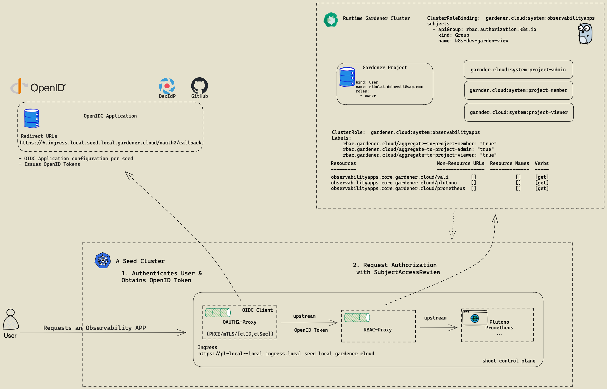

# oidc-apps-controller
[](https://api.reuse.software/info/github.com/gardener/oidc-apps-controller)
[](https://concourse.ci.gardener.cloud/teams/gardener/pipelines/oidc-apps-controller-main/jobs/main-head-update-job)
[](https://goreportcard.com/report/github.com/gardener/oidc-apps-controller)
[](LICENSE) [](https://github.com/gardener/oidc-apps-controller) [](https://pkg.go.dev/github.com/gardener/oidc-apps-controller)

## Usage

This controller enhances target deployments and statefulsets with side-cars containers for performing oidc authentications and k8s rbac authorization for incoming http requests.

Usually applications such as`prometheus` do not offer any security mechanisms and delegate such responsibilities to cluster owners. This controller aims at providing a solution for bringing authentication [(oauth2-proxy)](https://github.com/oauth2-proxy/oauth2-proxy) and authorization [(kube-rbac-proxy)](https://github.com/brancz/kube-rbac-proxy)
layers in front of the targeted workloads, simplifying required configurations in a consistent way.

Targets for enhancement are identified by using labels and/or namespaces selectors.
For example

```yaml
# OIDC Apps Extension Configuration for a k8s cluster
configuration:
  oidcProviderConfig:
    scope: "openid"  # The default OIDC scope.
    clientId: "nginx"  # Client identifier in the oidc provider configuration.
    oidcIssuerUrl: "https://oidc.provider.com"  # OIDC issuer
  domainName: "company.org" # Cluster wide domain, shared by all enhanced targets

# All deployments in the cluster with app=nginx label are enhanced by the oidc-app-controller
targets:
  - name: nginx
    labelSelector: # matching labels for the deployments
      matchLabels:
        app: nginx
    targetPort: http # upstream port of the targeted container
    targetProtocol: http # upstream protocol
    ingress:
      create: true
      tlsSecretRef:
        name: "ingress-wildcard-tls"
```



External dependencies:

- [oauth2-proxy](https://github.com/oauth2-proxy/oauth2-proxy)
- [kube-rbac-proxy](https://github.com/brancz/kube-rbac-proxy)

## Feedback and Support

Feedback and contributions are always welcome. Please report bugs or suggestions as [GitHub issues](https://github.com/gardener/gardener-extension-os-gardenlinux/issues) or join our [Slack channel #gardener](https://kubernetes.slack.com/messages/gardener) (please invite yourself to the Kubernetes workspace [here](http://slack.k8s.io)).

## Learn more

Please find further resources about out project here:

* [Our landing page gardener.cloud](https://gardener.cloud/)
* ["Gardener, the Kubernetes Botanist" blog on kubernetes.io](https://kubernetes.io/blog/2018/05/17/gardener/)
* ["Gardener Project Update" blog on kubernetes.io](https://kubernetes.io/blog/2019/12/02/gardener-project-update/)
* [Gardener Extensions Golang library](https://godoc.org/github.com/gardener/gardener/extensions/pkg)
* [GEP-1 (Gardener Enhancement Proposal) on extensibility](https://github.com/gardener/gardener/blob/master/docs/proposals/01-extensibility.md)
* [Extensibility API documentation](https://github.com/gardener/gardener/tree/master/docs/extensions)
